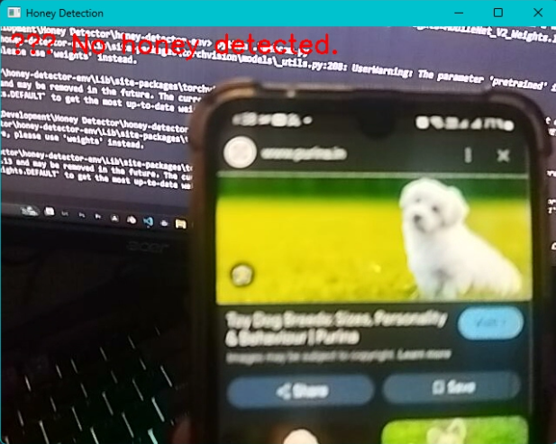
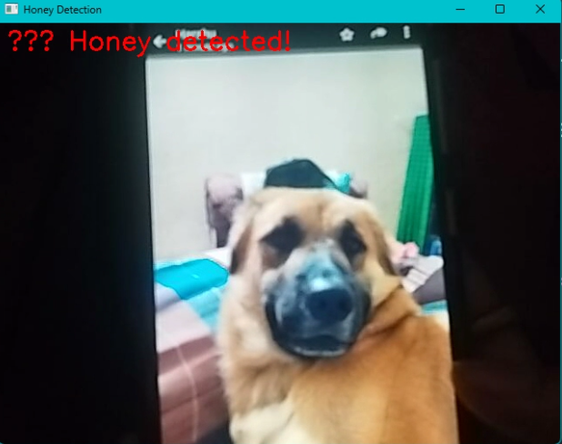
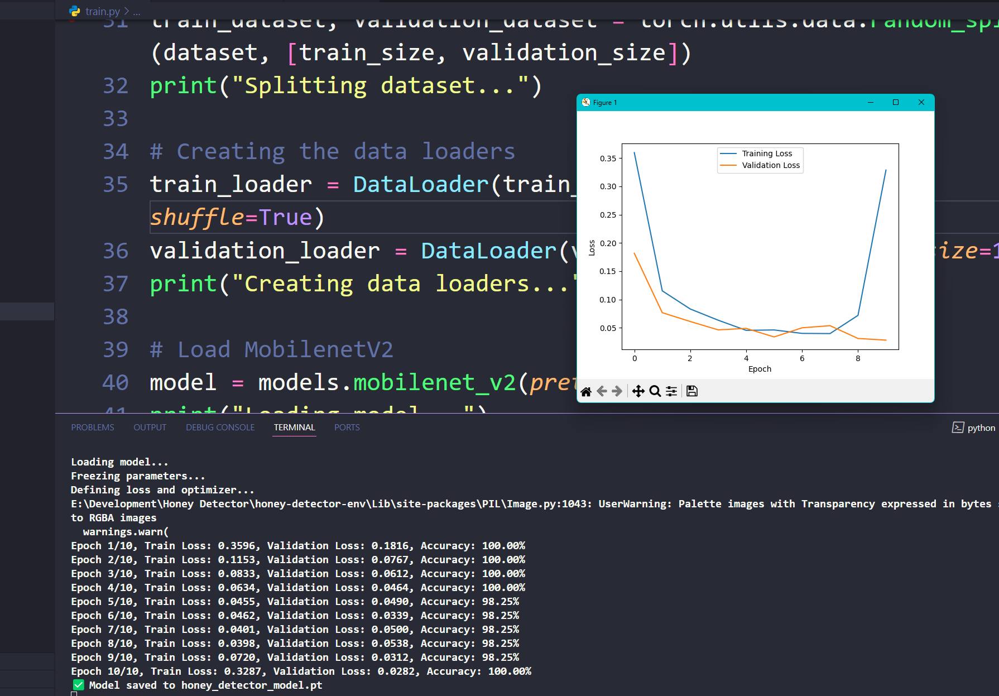

# 🐶 Honey Detector

A simple Python app that uses [OpenCV](https://opencv.org) and PyTorch to detect **Honey** – a specific pet dog – in real-time video feed using your webcam! 🎥🐾

This project demonstrates the use of **Machine Learning** and **Computer Vision** to distinguish Honey from other dogs, humans, or objects in live camera input.

---

## 📚 Contents
- [🔍 Overview](#-overview)
- [⚙️ Installation](#-installation)
- [🚧 To Do](#-to-do)

---

## 🔍 Overview

### ❌ Honey Not Detected


If Honey is **not** in the frame, the app shows a "Not Honey!" message.

---

### ✅ Honey Detected


If Honey **is** detected, the app proudly announces: **"Honey!"**

This app is currently a Python script that runs on your local machine using `OpenCV`. Future plans include building a **web interface using Flask** (target date: 08-06-2025).

---

## 🧠 What's Inside

### 📦 `requirements.txt`
Lists all Python packages needed to run the project.

### 🖼️ `downloaded_scripts/download_images.py`
Used to download **non-Honey** images from the internet using `simple_image_download`.  
(Note: The `simple_images/` folder is ignored by Git.)

### 🏋️‍♂️ `train.py`
Trains a **binary classifier** model to detect Honey vs. Not Honey.  
Outputs the trained model as `honey_detector_model.pt` and also plots training loss and accuracy.



### 🔍 `predict.py`
A script to run predictions on test images using the trained model.

### 🎥 `webcam.py` & `webcam_detect.py`
These scripts run real-time honey detection using your webcam.  
They demonstrate how the trained model is integrated into a live video feed using OpenCV.

> 💡 **Note**: Future plans include creating a web version using Flask, or a desktop app using Tkinter.

---

## ⚙️ Installation

As of **08-06-2025**, the app is executable only via **Python** + **OpenCV**.

### 🔧 Steps to Get Started
1. 🧬 Clone the repository:
   ```bash
   git clone https://github.com/your-username/honey-detector.git
   ```

2. 📦 Install dependencies:
   ```bash
   pip install -r requirements.txt
   ```

3. 📁 Request dataset access by opening an [issue](https://github.com/plagzee/honey-detector/issues).

4. 🚀 Run the app:
    ```bash
    python webcam.py
    ```


## 🚧 To Do
* [x] 🌐 Convert the Python-based system into a Flask web app
* [x] 📱 Explore mobile/web compatibility
* [x] 🪟 Optional: Build a desktop version using Tkinter or PyQt
* [x] 🔒 Model security improvements
* [x] 🧪 Add unit tests and improve dataset validation

Made with ❤️ for a dog named Honey.
